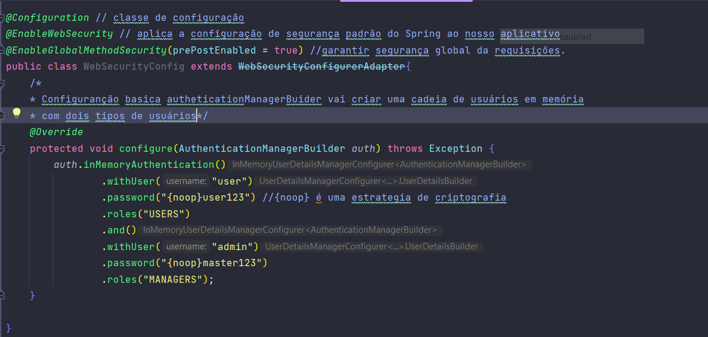
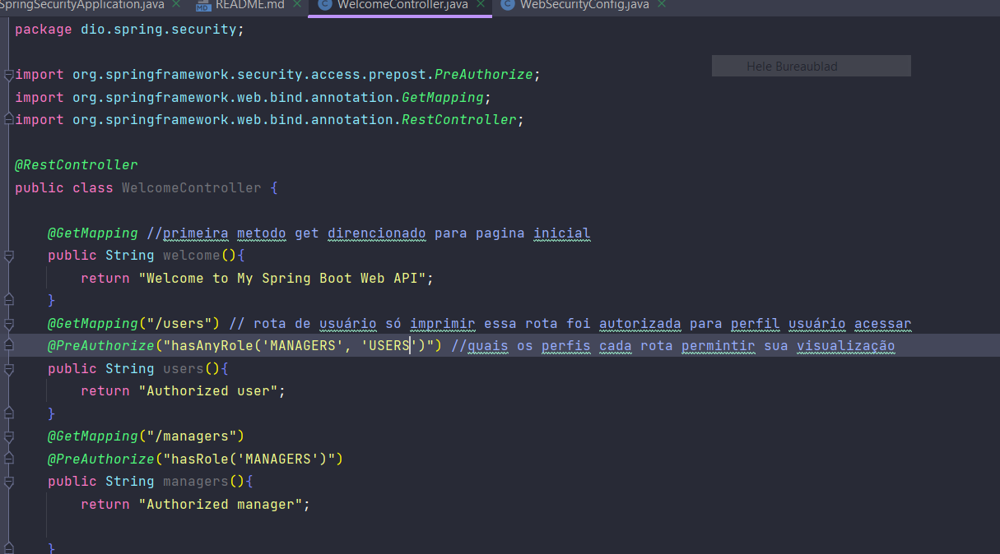

# Springboot Security com JWT

## Introdução
**Spring Security** é apenas um grupo de filtros de servlet que ajudam você a adicionar autenticação e 
autorização ao seu aplicativo da web.

## Terminologia
* **A autenticação**: exemplo como inserir um nome de usuário e uma senha ao fazer login em um site.

* **Autorização**: supondo que o usuário seja autenticado com êxito. 

* **Princípio**: refere-se ao usuário autenticado no momento.
* **Autoridade Concedida**: refere-se à permissão do usuário autenticado.
* **Função**: refere-se à um grupo de permissões do usuário autenticado.

## Autenticação Simples
O Spring possui algumas configurações para definir os usuários na sua camada de segurança.

Como sabemos por padrão o Spring Security habilita um usuário de nome user e gera uma senha aleatoriamente
a cada inicialização. Esta não é uma abordagem um tanto aconselhável, conhecer algumas outras configurações de segurança.

## No application.properties
O Spring Security verifica se existe alguma configuração no arquivo **application.properties**
Neste autenticação vale apena somente para um usuário. Agora será aplicado mais usuários.

## Em Memória
Esta configuração permite criar mais de um usuários e perfis de acesso.
É necessário criar uma classe que estenda `WebSecurityConfigurerAdapter`

Vamos imaginar que a nossa API possui três acessos, a nossa página de boas-vindas, uma página
a nível de perfil **user** e uma página disponível somente para **managers**.

## Configure Adapter
Nos exemplos acima já podemos considerar um nível de segurança em nossa aplicação, mas se
percebemos o esforço de configuração para novas funcionalidades poderá não ser uma abordagem tão
satisfatório. Para isso vamos tentar deixar a parte de configuração centralizada na classe 
**WebSecurityConfig**, removendo configurações adicionais em nossos **controllers**.

## Autenticação com Bancos de Dados

**UserDetailService**
A interface _UserDetailService_ é usada para recuperar dados relacionados ao usuário.
Ele possui um método denominado _loadUserByUsername()_ que pode ser substituído para personalizar o processo
de localização do usuário.

